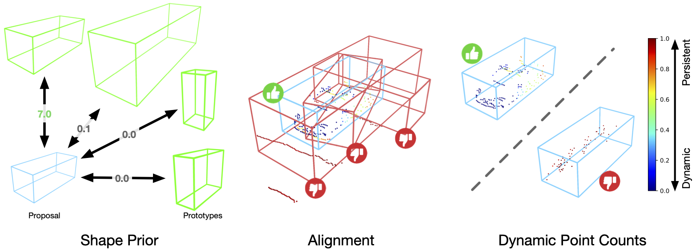

# DRIFT: Reward Finetuning for Faster and More Accurate Unsupervised Object Discovery
This is the official code release for
[[NeurIPS 2023] **Reward Finetuning for Faster and More Accurate Unsupervised Object Discovery**](https://arxiv.org/abs/2310.19080).

by [Katie Z Luo](https://www.cs.cornell.edu/~katieluo/)\*, [Zhenzhen Liu](https://scholar.google.com/citations?user=dGMjHEwAAAAJ&hl=en)\*, [Xiangyu Chen](https://www.cs.cornell.edu/~xchen/)\*, [Yurong You](https://yurongyou.com/), [Sagie Benaim](https://sagiebenaim.github.io/), [Cheng Perng Phoo](https://www.cs.cornell.edu/~cpphoo/), [Mark Campbell](https://research.cornell.edu/researchers/mark-campbell), [Wen Sun](https://wensun.github.io/), [Bharath Hariharan](http://home.bharathh.info/), and [Kilian Q. Weinberger](https://www.cs.cornell.edu/~kilian/)

[Paper](https://arxiv.org/abs/2310.19080) | [Video](https://youtu.be/_6xQGmhMfic)

**Interested in perception with about 3D object discovery? Also see [MODEST](https://github.com/YurongYou/MODEST).**

<!--  -->


### Abstract
Recent advances in machine learning have shown that Reinforcement Learning from Human Feedback (RLHF) can improve machine learning models and align them with human preferences. Although very successful for Large Language Models (LLMs), these advancements have not had a comparable impact in research for autonomous vehicles -- where alignment with human expectations can be imperative. In this paper, we propose to adapt similar RL-based methods to unsupervised object discovery, i.e. learning to detect objects from LiDAR points without any training labels. Instead of labels, we use simple heuristics to mimic human feedback. More explicitly, we combine multiple heuristics into a simple reward function that positively correlates its score with bounding box accuracy, i.e., boxes containing objects are scored higher than those without. We start from the detector's own predictions to explore the space and reinforce boxes with high rewards through gradient updates. Empirically, we demonstrate that our approach is not only more accurate, but also orders of magnitudes faster to train compared to prior works on object discovery.

## Table of Contents
- [Main Results](#main-results)
- [Installation](#installation)
- [Data Setup](#data-setup)
- [DRIFT Training and Evaluation](#drift-training-and-evaluation)
- [Citation](#citation)

## Main Results

We provide necessary checkpoints for our experiment, including the baseline model trained on MODEST seed labels (before applying DRIFT) and models finetuned with DRIFT on Lyft and Ithaca365.

#### Lyft Experiment Models
Below we provide results, configs, and checkpoints on the Lyft dataset.

|               |  mAP | Model | Config |
|---------------|:----:|:-----:|:------:|
|    Baseline   | 23.9 |  [ckpt](https://drive.google.com/file/d/1yiiCwenvJVwGk7jleZyijMKR1NLIZ3g8/view?usp=sharing) |   [cfg](downstream/OpenPCDet/tools/cfgs/lyft_models/pointrcnn_dynamic_obj.yaml)  |
|  DRIFT (60ep) | 26.7 |  [ckpt](https://drive.google.com/file/d/16rRaVDkzMiVDs2kO0llMRujI29gD_Kjv/view?usp=sharing) |   --  |
| DRIFT (120ep) | 29.6 |  [ckpt](https://drive.google.com/file/d/14qez2K0jpvayNosgJHMhxwbDWE8LmDgG/view?usp=sharing) |   [cfg](downstream/OpenPCDet/tools/cfgs/lyft_models/pointrcnn_dynamic_drift.yaml)  |


#### Ithaca365 Experiment Models
Below we provide results, configs, and checkpoints on the Ithaca365 dataset.

|              |  mAP | Model | Config |
|--------------|:----:|:-----:|:------:|
|   Baseline   |  7.7 |  [ckpt](https://drive.google.com/file/d/1X7iT9PmnxMJYM4r_qrpuXJhy7OZe0a6I/view?usp=sharing) |   [cfg](downstream/OpenPCDet/tools/cfgs/ithaca365_models/pointrcnn_dynamic_obj.yaml)  |
| DRIFT (15ep) | 28.0 |  [ckpt](https://drive.google.com/file/d/1neJkOCw4CCHX0E1WvQ1Jfuc3p9G5eXzM/view?usp=sharing) |   --  |
| DRIFT (30ep) | 35.1 |  [ckpt](https://drive.google.com/file/d/1K_xPCAUwQVyb3Bx1ynba5YX2OoZaCQV7/view?usp=sharing) |   [cfg](downstream/OpenPCDet/tools/cfgs/ithaca365_models/pointrcnn_dynamic_drift.yaml)  |


## Installation

Setup with Anaconda environment:

```bash
conda create --name drift python=3.8
conda activate drift
conda install pytorch=1.9.0 torchvision torchaudio cudatoolkit=11.1 -c pytorch -c nvidia
pip install opencv-python matplotlib ray wandb scipy tqdm easydict scikit-learn pillow==8.3.2
```

Install some necessary dependencies, and build the project. Rote-DA is built off of the [OpenPCDet framework](https://github.com/open-mmlab/OpenPCDet):

```bash
# install openpcdet
cd ../../../downstream/OpenPCDet
pip install -r requirements.txt
python setup.py develop

# for managing experiments
pip install hydra-core --upgrade
pip install hydra_colorlog --upgrade
pip install rich
```

Install [Minkowski Engine](https://github.com/NVIDIA/MinkowskiEngine.git):

```bash
# ME
git clone https://github.com/NVIDIA/MinkowskiEngine.git
cd MinkowskiEngine
git checkout c854f0c # 0.5.4
# NOTE: need to run this on a node with GPUs
python setup.py install
```

Install a custom [Spatially Sparse Convolution Library](https://github.com/traveller59/spconv) build:

```bash
# install customized spconv
cd third_party/spconv
python setup.py bdist_wheel
cd ./dist
pip install spconv-1.2.1-cp38-cp38-linux_x86_64.whl
```

## Data Setup
#### Preprocessing data
Please refer to [`data_preprocessing/lyft/LYFT_PREPROCESSING.md`](data_preprocessing/lyft/LYFT_PREPROCESSING.md) and
[`data_preprocessing/ithaca365/ITHACA365_PREPROCESSING.md`](data_preprocessing/ithaca365/ITHACA365_PREPROCESSING.md).

#### Precomputing Seed Labels
This project builds upon the [MODEST](https://github.com/YurongYou/MODEST) codebase. Follow the precomputation of P2 Scores as well as the baseline model trained on seed labels [according to their set-up](https://github.com/YurongYou/MODEST?tab=readme-ov-file#generate-seed-labels). For simplicity, we also provide the baseline model checkpoint of the detectors trained on seed labels in [Model Checkpoints](#model-checkpoints) section.


To generate P2 score to adapt to the *Lyft* dataset:
```bash
cd $PROJECT_ROOT_DIR
# generate pp score
python generate_cluster_mask/pre_compute_p2_score.py
```

To generate P2 score to adapt to the *Ithaca* dataset:
```bash
cd $PROJECT_ROOT_DIR
# generate pp score
python generate_cluster_mask/pre_compute_p2_score.py dataset="ithaca365" data_paths="ithaca365.yaml"
```

## DRIFT Training and Evaluation

#### DRIFT File Changes
All DRIFT training step changes are incorporated into the `forward()` call of PointRCNN, located here: `downstream/OpenPCDet/pcdet/models/detectors/point_rcnn.py`.
All DRIFT rewards and reward helper-functions are located in `downstream/OpenPCDet/pcdet/models/model_utils/rewards.py`. Exploration and additional util functions can be found in `downstream/OpenPCDet/pcdet/models/model_utils/unsupervised_regression_utils.py`.

#### Launch Training
Results reported in the paper are trained using 4 GPUs. To launch training on 4 GPUs, activate the conda environment and run the following self-training scripts:

```bash
# Lyft
bash scripts/dist_train.sh 4 --cfg_file cfgs/lyft_models/pointrcnn_dynamic_drift.yaml --merge_all_iters_to_one_epoch --fix_random_seed --pretrained_model <LYFT_BASELINE_CKPT>

# Ithaca365
bash scripts/dist_train.sh 4 --cfg_file cfgs/ithaca365_models/pointrcnn_dynamic_drift.yaml --merge_all_iters_to_one_epoch --fix_random_seed --pretrained_model <ITHACA_BASELINE_CKPT>
```

#### Evaluate Checkpoints
Evaluation on multiple GPUs can be done on each checkpoint with `scripts/dist_test.sh`. To evaluate on 4 GPUs, activate the conda environment and run the following eval scripts:
```bash
cd downstream/OpenPCDet/tools
bash scripts/dist_test.sh 4 --cfg_file <cfg> --ckpt <ckpt_path>
```

### Citation
If this work is helpful for your research, please consider citing us!
```
@inproceedings{luo2023reward,
  title={Reward Finetuning for Faster and More Accurate Unsupervised Object Discovery},
  author={Luo, Katie Z and Liu, Zhenzhen and Chen, Xiangyu and You, Yurong and Benaim, Sagie and Phoo, Cheng Perng and Campbell, Mark and Sun, Wen and Hariharan, Bharath and Weinberger, Kilian Q},
  booktitle={Thirty-seventh Conference on Neural Information Processing Systems},
  year={2023}
}
```
